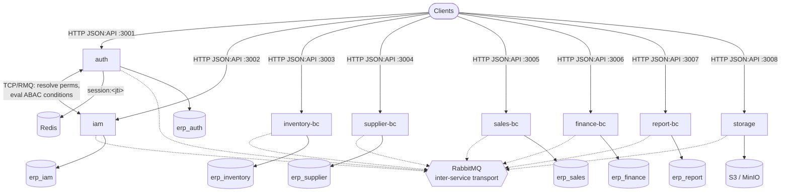
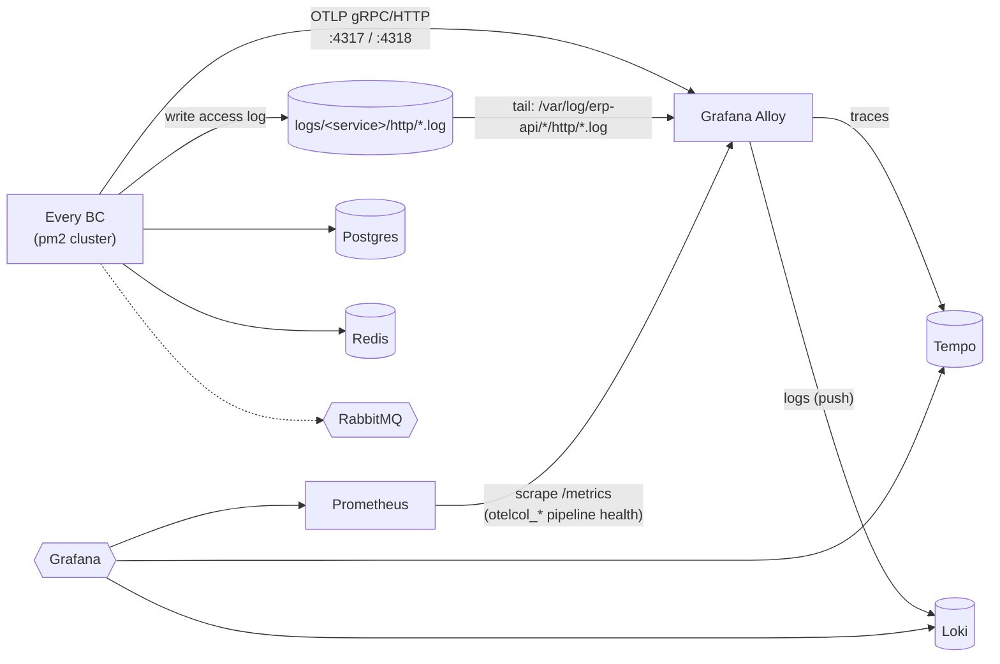

# erp-api

Backend implementation of an Enterprise ERP system — **Microservices · DDD** — built with
NestJS 11, Fastify, TypeORM, and PostgreSQL.

> The product/architecture plan lives in the [`docs/plan-erp`](docs/plan-erp) git submodule and
> is the **authoritative spec** for features, phases, and conventions. Coding conventions for
> this repo are enforced in [`CLAUDE.md`](CLAUDE.md) and [`CODE_OF_CONDUCT.md`](CODE_OF_CONDUCT.md) — read
> both before opening a PR.

## Architecture overview

One NestJS app per **Bounded Context (BC)**, each with its own PostgreSQL database (database-per-
context — no cross-DB foreign keys, BCs reference each other by UUID only), its own HTTP port +
its own TCP/RabbitMQ microservice endpoint for inter-service calls. Every BC runs behind pm2 in
`cluster` mode (2 instances each — see `ecosystem.config.js`).



| App (`apps/`) | Port | Database | Owns |
|---|---|---|---|
| `auth` | `3001` | `erp_auth` | `credentials`, `refresh_tokens`, `login_histories`, `blocked_users`, `security_logs` — **no user profile data** |
| `iam` | `3002` | `erp_iam` | `users` (source of truth), `roles`, `policies` / `policy_statements` / `statement_*`, `permissions` catalog |
| `inventory-bc` | `3003` | `erp_inventory` | products, brands, UOM, warehouses |
| `supplier-bc` | `3004` | `erp_supplier` | suppliers |
| `sales-bc` | `3005` | `erp_sales` | sales domain |
| `finance-bc` | `3006` | `erp_finance` | finance domain |
| `report-bc` | `3007` | `erp_report` | reporting (CQRS read models) |
| `storage` | `3008` | — (S3/MinIO) | file objects — stateless, no Postgres DB |

Ports/prefixes above are the `.env.example` defaults (`<BC>_MODULE_HTTP_PORT` /
`<BC>_PREFIX_NAME`) — every value is configurable per environment.

### Infrastructure & observability

Datastores (Postgres/Redis/RabbitMQ) and the observability stack (traces/logs/metrics) are plain
Docker Compose stacks under [`infrastructure/`](infrastructure) — see
[`infrastructure/README.md`](infrastructure/README.md) for how to run them. Every BC ships
structured HTTP access logs to disk (`logs/<service>/http/http.<date>.<n>.log` — see
`libs/common/src/utils/logger/pino-http.config.ts`) and OTLP traces directly to the collector;
this is how they flow into Grafana:



`OTEL_EXPORTER_OTLP_ENDPOINT` (`.env`) points every app at Alloy; `TRANSPORT=rmq`/`tcp` picks
inter-service transport independently of tracing. `LOG_LEVEL` (`.env`) controls pino's verbosity;
the access-log file glob Alloy tails (`config.alloy`'s `local.file_match`) must have one `*` per
path segment the logger actually creates — see the gotcha note in
[`infrastructure/README.md`](infrastructure/README.md#observability---traces-logs-metrics) if logs
stop showing up in Loki after a logging-path change.

**Shared libs** (`libs/`):

- `@lib/common` — `@Global()` module providing `ConfigModule`, `RedisModule`, `LogModule`, a TCP
  `ClientsModule` entry per BC, `MicroserviceClientService` (no-throw `sendWithContext`), the
  global `AuthGuard` + `PermissionGuard` (registered as `APP_GUARD` — every non-`@Public()`
  endpoint in every BC is authenticated/authorized without per-app wiring), `TransformInterceptor`
  + `LocalizationInterceptor` (response shaping), `AllExceptionsFilter`/`RpcExceptionsFilter`,
  `BaseEntity`, `BaseServiceOperations`/`BaseControllerOperations` (generic CRUD), and shared
  decorators (`@RequirePermission`, `@ResourceType`, `@CurrentUser`, `@ValidatedQuery`, `@Public`).
- `@lib/config` — single Joi-validated env schema shared by every app.
- `@lib/database` — per-BC `DataSource`s (TypeORM CLI) and all migrations
  (`libs/database/src/migrations/erp_<bc>/`).
- `@lib/contracts` — FE-facing TypeScript types mirroring API response shapes.

## Identity & Access (Phase 1)

- **Auth flow**: `POST /auth/login` verifies credentials (bcrypt) against `erp_auth`, calls
  `iam` over TCP to resolve the user's profile + net permission set (RBAC → Policy → Statement,
  deny-override), issues a short-lived JWT access token + rotating refresh token, and tracks the
  session in Redis (`session:<jti>`) so logout/role-change can revoke it immediately.
- **Authorization**: RBAC (roles) + PBAC (policies made of allow/deny statements) + ABAC
  (per-statement conditions evaluated against request context — owner, department, time, IP).
  `AuthGuard` verifies the JWT + Redis session; `PermissionGuard` checks the JWT's flat
  `permissions` list first, falling back to a live condition-evaluation call to `iam` for
  permissions flagged `conditional_permissions` at login.
- **Permission catalog**: never hand-maintained. `npm run permissions:sync` scans every
  `@RequirePermission('resource:action', { th, en })` call across all BCs and syncs iam's
  `permissions` table (soft-delete on removal, full sync history in `permission_sync_logs`).

Full spec: [`docs/plan-erp/srs-p1.html`](docs/plan-erp/srs-p1.html).

## i18n (TH/EN)

DB stores flat parallel columns (`name_th` / `name_en`), never JSONB for normal fields. Input
DTOs and submit payloads use the flat keys; the `LocalizationInterceptor` collapses each pair
into a nested `{ th, en }` object on **response only**. See
[`docs/plan-erp/i18n-guide.html`](docs/plan-erp/i18n-guide.html).

## API responses

Every controller carries `@ResourceType('<plural-resource>')`; the `TransformInterceptor` wraps
the result into a JSON:API envelope: `{ status: { code, message }, data | errors, meta, links }`,
where `status.code` is a 6-digit code (`HTTP status × 1000 + serial`, e.g. `200000`).

## Getting started

### Prerequisites

- Node.js 22+, [pnpm](https://pnpm.io/)
- PostgreSQL (one database per BC — see table above)
- Redis (sessions)
- RabbitMQ (inter-service transport; set `TRANSPORT=tcp` in `.env` to fall back to direct TCP
  if unavailable)

Don't have these running locally? [`infrastructure/infra-erp`](infrastructure/infra-erp) is a
Docker Compose stack with all three — see [Infrastructure & observability](#infrastructure--observability)
above and [`infrastructure/README.md`](infrastructure/README.md) for details.

### Setup

```bash
# 1. Install dependencies
pnpm install

# 2. Configure environment
cp .env.example .env
# edit .env — DB/Redis/RabbitMQ connection details, SECRET_KEY, etc.

# 3. Pull the architecture/spec submodule
git submodule update --init --recursive

# 4. Create each BC's database, then run its migrations
npm run migration:run:auth
npm run migration:run:iam
# ...or all at once:
npm run migration:run:all

# 5. Sync the permission catalog from @RequirePermission() usage
npm run permissions:sync
```

Migrations seed a bootstrap `admin` user/role/policy in `iam` and a matching `admin` credential
in `auth` (default password `Admin@12345` — **change it after first login**).

### Run

```bash
# one service
npm run start:dev:auth
npm run start:dev:iam

# everything at once
npm run start:dev:all

# production
npm run build:auth && npm run start:prod:auth
```

Each app exposes Swagger/Scalar API docs and a `/<prefix>/health` endpoint once running (ports
and prefixes are configured per-BC in `.env`, e.g. `AUTH_MODULE_HTTP_PORT`, `IAM_PREFIX_NAME`).

### Database migrations

One `typeorm:<bc>` / `migration:run:<bc>` / `migration:generate:<bc>` / `migration:revert:<bc>`
script per BC (see `package.json`). Example for a new `iam` migration:

```bash
npm run migration:generate:iam --name=AddSomethingToRoles
npm run migration:run:iam
```

### Permissions catalog

`permissions:sync` scans every `@RequirePermission('resource:action', { th, en })` call across
all BCs and syncs the result into iam's `permissions` table — run it after adding, renaming, or
removing any `@RequirePermission()` call, before wiring a policy statement to it in the Policy
Generator:

```bash
npm run permissions:sync
```

Safe to re-run any time: unchanged permissions are left alone, permissions no longer found in
code are soft-deleted (never hard-deleted), and every run is logged to `permission_sync_logs`
for a full add/remove history. It only touches `plane = 'api'` rows — `ui` permissions
(`page:*`, `component:*`) are managed manually and are never touched by this command.

### Tests & linting

```bash
pnpm test          # unit tests
pnpm test:cov      # coverage
pnpm lint          # eslint --fix
pnpm format        # prettier --write
```

## Contributing

Read [`CLAUDE.md`](CLAUDE.md) (naming, response envelope, error handling, i18n, permissions,
Swagger conventions) and [`CODE_OF_CONDUCT.md`](CODE_OF_CONDUCT.md) before making changes —
conventions are enforced, not optional. The
[`implement-entity`](.claude/skills/implement-entity/SKILL.md) skill documents the full workflow
(and required conventions) for adding a new entity/CRUD resource to a BC.
